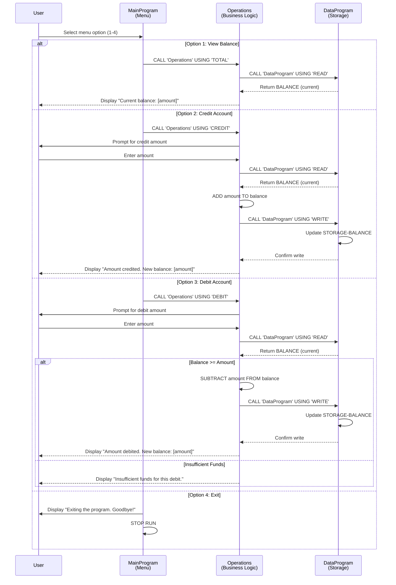

# Student Account Management System - COBOL Documentation

## Overview
This document provides comprehensive documentation for the legacy COBOL-based Student Account Management System. The system manages student account balances with support for viewing balances, crediting accounts, and debiting accounts with built-in validation.

---

## COBOL Files Documentation

### 1. **main.cob** - Main Program Entry Point

#### Purpose
The primary user interface and control flow handler for the Account Management System. This program displays an interactive menu and orchestrates calls to other modules based on user input.

#### Key Functions
- **Menu Display**: Presents a user-friendly menu with four options
- **User Input Collection**: Accepts user choice (1-4)
- **Program Orchestration**: Routes user selections to appropriate operations
- **Session Management**: Maintains program flow until user chooses to exit

#### Business Rules
- Menu options available:
  - **Option 1**: View Balance - Displays current account balance
  - **Option 2**: Credit Account - Adds funds to student account
  - **Option 3**: Debit Account - Withdraws funds from student account
  - **Option 4**: Exit - Terminates the program
- Invalid choices trigger an error message (selection must be 1-4)
- Program runs in a loop until user selects "Exit"
- Displays farewell message upon termination

#### Technical Details
- **Program ID**: MainProgram
- **Working Storage**: USER-CHOICE (numeric), CONTINUE-FLAG (alphanumeric)

---

### 2. **operations.cob** - Business Logic Handler

#### Purpose
Implements the core business operations for the account management system. Handles all account transactions and balance calculations.

#### Key Functions
- **TOTAL Operation**: Retrieves and displays the current account balance
- **CREDIT Operation**: Adds a specified amount to the student account balance
- **DEBIT Operation**: Subtracts a specified amount from the student account balance with validation

#### Business Rules

##### Balance Display (TOTAL)
- Retrieves current balance from data storage
- Displays balance in currency format (9(6)V99)

##### Credit Operation
- Accepts user input for credit amount
- Reads current balance from storage
- Adds credit amount to balance
- Updates data storage with new balance
- Displays confirmation message with new balance

##### Debit Operation
- Accepts user input for debit amount
- Reads current balance from storage
- **Validates Sufficient Funds**: Only allows debit if balance >= debit amount
- If sufficient funds exist: Deducts amount and updates storage
- If insufficient funds: Displays error message and prevents transaction
- Displays confirmation or error message accordingly

#### Technical Details
- **Program ID**: Operations
- **Working Storage**: OPERATION-TYPE (6 chars), AMOUNT (currency), FINAL-BALANCE (currency, default: 1000.00)
- **Linked Operations**: Calls DataProgram for READ and WRITE operations
- **Data Format**: Currency values use PIC 9(6)V99 format (up to 999,999.99)

---

### 3. **data.cob** - Data Storage Module

#### Purpose
Provides centralized data persistence layer for account balance information. Acts as the single source of truth for account balance storage and retrieval.

#### Key Functions
- **READ Operation**: Retrieves current balance from storage
- **WRITE Operation**: Persists updated balance to storage
- **Data Initialization**: Initializes default balance value

#### Business Rules
- **Initial Balance**: All accounts begin with a balance of 1000.00
- **Storage Mechanism**: Uses working storage (in-memory) for balance persistence
- **Operation Types**: 
  - 'READ' - Retrieves STORAGE-BALANCE and returns via BALANCE parameter
  - 'WRITE' - Accepts BALANCE parameter and updates STORAGE-BALANCE
- **Data Integrity**: No balance validation at storage level (delegated to Operations layer)

#### Technical Details
- **Program ID**: DataProgram
- **Working Storage**: STORAGE-BALANCE (default: 1000.00), OPERATION-TYPE (6 chars)
- **Linkage Section**: PASSED-OPERATION (operation type), BALANCE (balance value)
- **Data Format**: Currency values use PIC 9(6)V99 format

---

## System Architecture

```
┌─────────────────┐
│   MainProgram   │
│  (User Menu)    │
└────────┬────────┘
         │
         │ Calls with operation type
         ▼
┌─────────────────────┐
│   Operations        │
│  (Business Logic)   │
└────────┬────────────┘
         │
         │ Calls with READ/WRITE
         ▼
┌──────────────────┐
│   DataProgram    │
│ (Data Storage)   │
└──────────────────┘
```

---

## Current Balance Management

- **Initial Balance**: 1000.00
- **Maximum Balance**: 999,999.99 (limited by PIC 9(6)V99)
- **Minimum Balance**: 0.00 (no negative balances allowed due to debit validation)

---

## Data Flow Sequence Diagram

The following diagram illustrates the complete data flow and interaction between components for each user operation:



---

## Future Modernization Considerations

This legacy COBOL system is a candidate for modernization efforts including:
- Migration to modern programming languages (Java, Python, etc.)
- Implementation of database persistence (replacing in-memory storage)
- Addition of transaction logging and audit trails
- Implementation of authentication and authorization
- RESTful API interface for system integration
- Unit testing and comprehensive error handling
- Support for multiple concurrent student accounts
